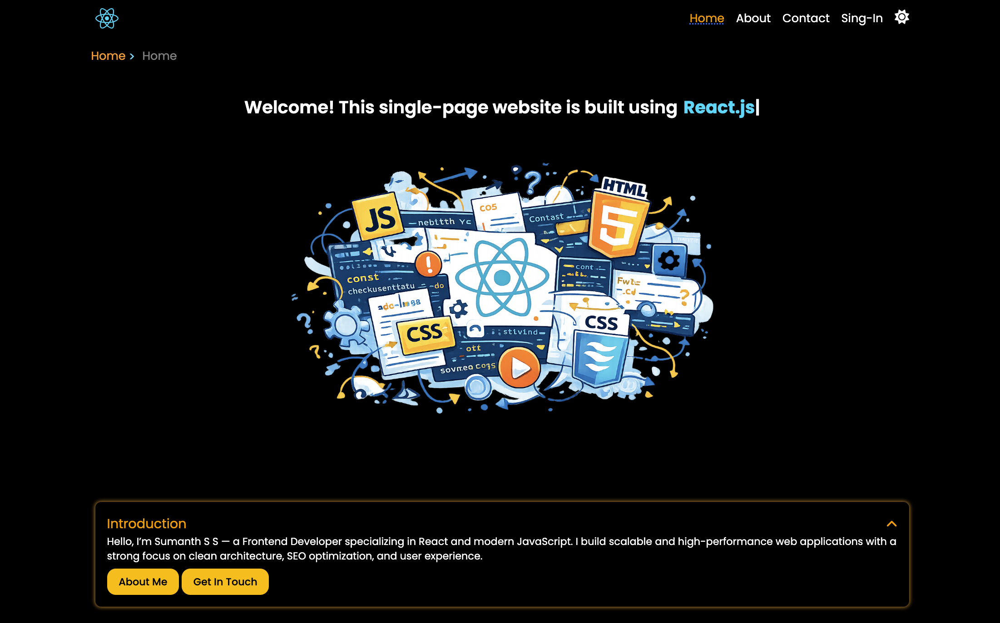
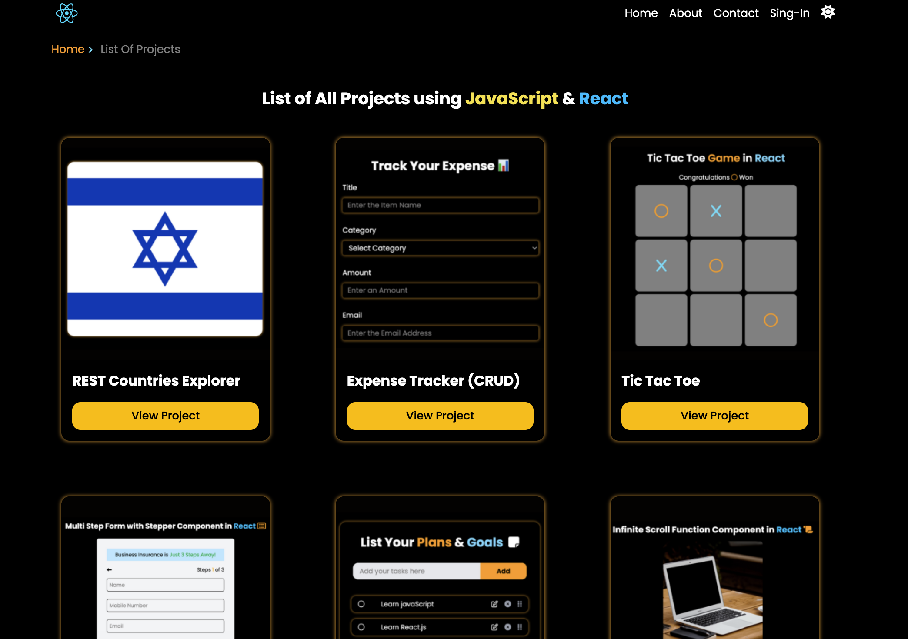
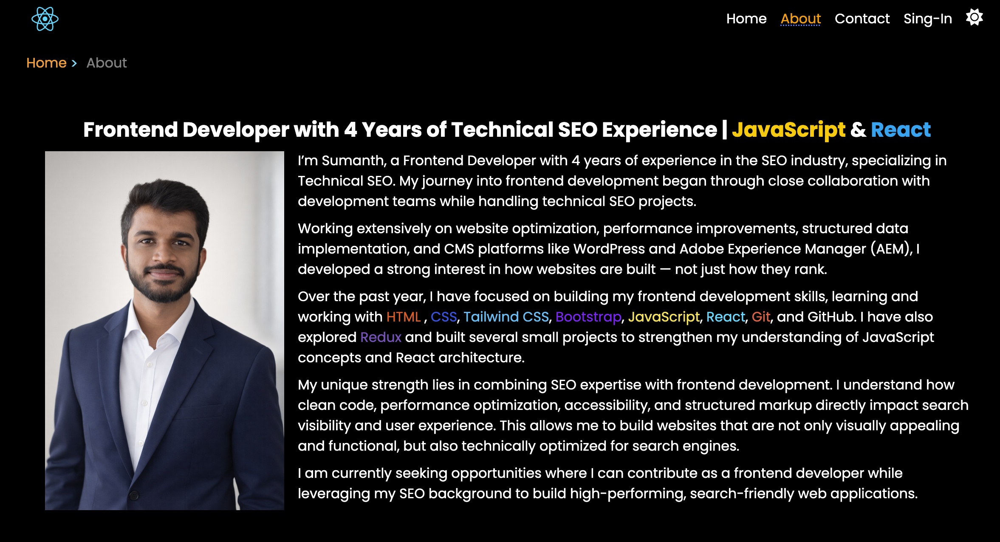
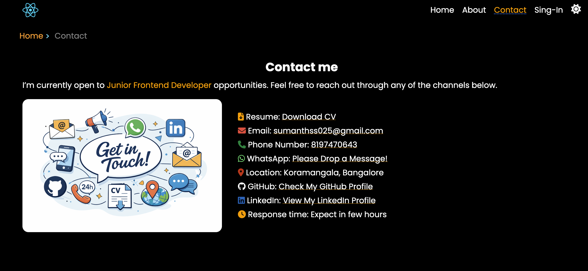

# My Personal Portfolio Website

The portfolio is structured into multiple pages, including:
- **Home Page** – Highlights my profile and showcases 6 of my strongest and most impactful React projects.
- **Projects Page** – Displays a complete list of all the React projects I have developed.
- **About Page** – Provides detailed information about my background, skills, and journey.
- **Contact Page** – Allows recruiters and collaborators to get in touch with me easily.

This project is built using modern frontend technologies to ensure a responsive, clean, and user-friendly experience across all devices.

---

## 🛠 Tech Stack

#### Core
- React.js
- JavaScript (ES6+)
- Tailwind CSS

#### Libraries & Tools
- Reactstrap (UI components & breadcrumb navigation)
- React Hook Form (form handling & validation)
- @dnd-kit (drag-and-drop functionality)
- React Router (SPA navigation with dynamic routing)
- Vite (fast build tool & development server)

#### Others
- REST APIs (for dynamic data rendering)

---

## ✨ Features

- ⚡ **Single Page Application (SPA)** – Implemented seamless navigation using React Router without page reloads.

- 🚀 **Performance Optimization** – Applied lazy loading and code splitting to improve load time and overall performance.

- 🌙 **Dark Mode Support** – Implemented theme switching with data persistence using localStorage and custom hooks.

- 🧭 **Dynamic Breadcrumb Navigation** – Built breadcrumb navigation to enhance user experience and improve SEO.

- ⏳ **Loading States Handling** – Added fallback UI components to display loading indicators during data fetching.

- ❌ **Error Handling** – Implemented proper error handling to ensure a smooth and stable user experience.

- 🧩 **Reusable Components Architecture** – Designed modular and reusable components to improve scalability and maintainability.

- 📱 **Responsive Design** – Fully responsive UI built using Tailwind CSS for all screen sizes.

- 🔗 **Project Showcase System** – Displays featured projects on the homepage and a complete project list on a dedicated page.

---

## 📸 Screenshots

### 🏠 Home Page

### 📂 Projects Page

### 👤 About Page

### 📞 Contact Page

---

## 📦 Installation

1. Clone the repository

git clone https://github.com/sumanth-git-hub/react-tasks-in-one-place/.git

2. Navigate into the project directory

cd recall-day-one

3. Install dependencies

npm install

4. Start the development server

npm run dev

---

## 📌 What I Learned

- 🧠 Strengthened my understanding of building scalable Single Page Applications (SPA) using React.

- ⚡ Gained hands-on experience in performance optimization techniques like lazy loading and code splitting.

- 🎯 Learned how to design and structure reusable components for better scalability and maintainability.

- 🌙 Implemented global state handling for features like dark mode using custom hooks and localStorage.

- 🧭 Improved UI/UX by integrating dynamic breadcrumb navigation and responsive design principles.

- 🔄 Understood the importance of proper state management and component reusability across multiple pages.

- ❌ Practiced handling loading states and errors to enhance user experience and application stability.

- 🔗 Worked with REST APIs to fetch and display dynamic data effectively.

- 🏗️ Learned how to structure a complete frontend project with clean architecture and best practices.

- 🔀 Learned and applied conditional rendering techniques to dynamically control UI based on application state.
