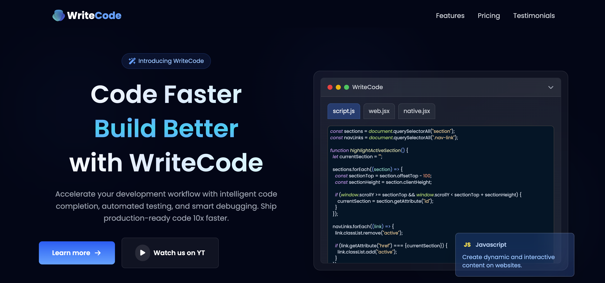
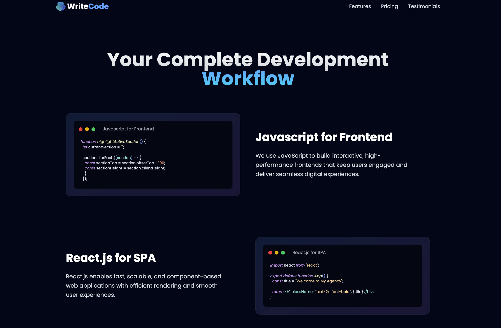
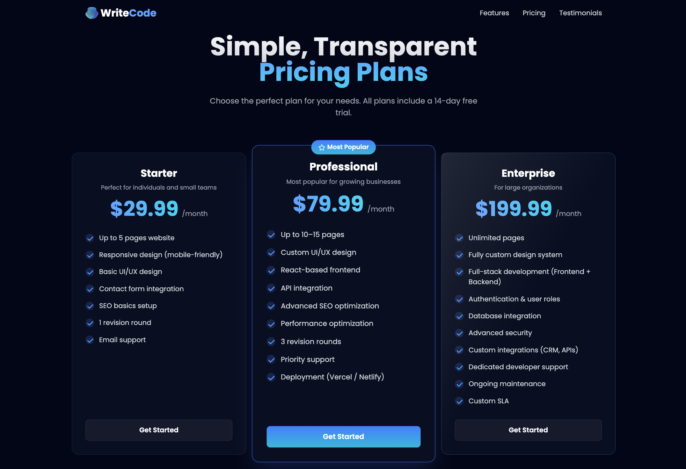
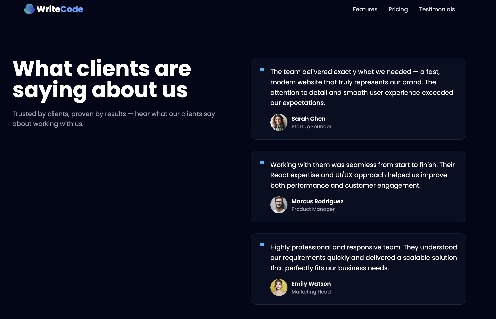
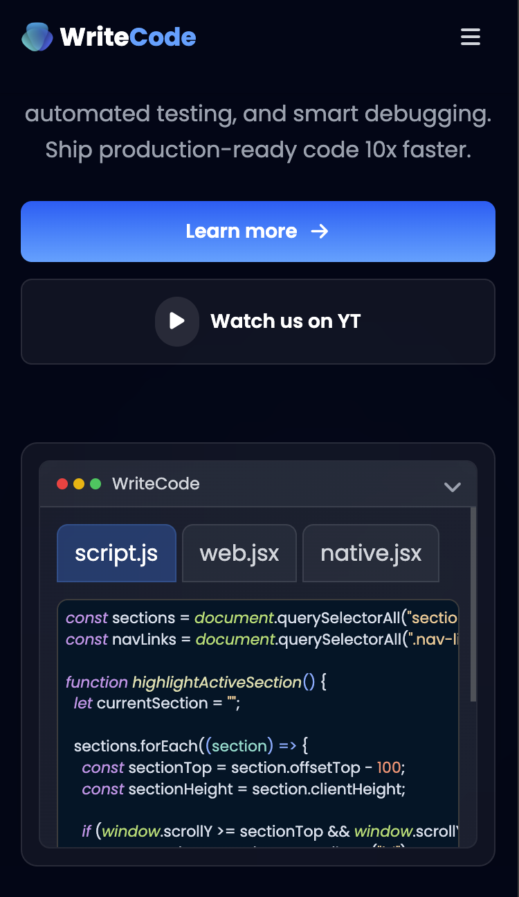

# 🌐 Modern UI/UX Single Page Website

This is a single-page modern UI/UX agency website built to showcase the agency’s offerings, including features, pricing, and testimonials.

The project focuses on delivering a clean, responsive, and visually appealing user experience, making it ideal for demonstrating front-end development skills and UI/UX design principles.

---

## ⚙️ Tech Stack

- **React** – Component-based UI development
- **React Syntax Highlighter** – Displaying formatted code snippets dynamically
- **Tailwind CSS** – Utility-first styling for modern UI design
- **React Create Portal** – Handling modal rendering outside the DOM hierarchy

---

## ✨ Features

- 🔄 **Dynamic Code Snippets Switching** – Users can switch between dummy code snippets on the webpage using state management and React Syntax Highlighter

- 🎨 **Modern UI/UX Design** – Built with Tailwind CSS to ensure a sleek, responsive, and user-friendly interface

- 💬 **Testimonials Section** – Showcases client feedback in an engaging layout

- 💰 **Pricing Section** – Clearly structured pricing plans for better user understanding

- 🧩 **Reusable Components** – Modular React components for scalability and maintainability.

- 📱 **Responsive Design** – Fully responsive UI built using Tailwind CSS for all screen sizes.

---

## 🛠️ Key Implementation Details
 - Used React state management to dynamically update UI elements like code snippets
 - Implemented React Syntax Highlighter for rendering formatted and readable code blocks
 - Designed UI using Tailwind CSS utility classes for faster and consistent styling
 - Leveraged React Portal for creating modals outside the root DOM node, improving accessibility and structure

## 📸 Screenshots

### 🏠 Home Section

### ✨ Features Section

### 💰 Pricing Section

### 💬 Testimonials Section

### 📲 Mobile View

---

## 📚 What I Learned

- How to build a modern, responsive UI using Tailwind CSS
- Practical usage of React Syntax Highlighter for dynamic content rendering
- Managing UI state effectively in React
- Implementing React Portals for modals and overlays
- Improving UI/UX design thinking for real-world projects

